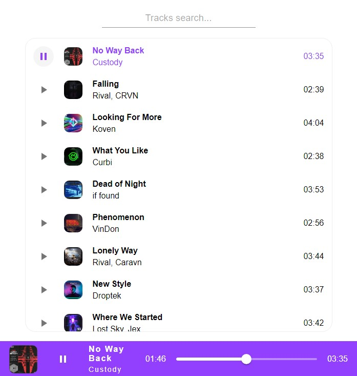

# Music App

Small and simple music application



## Tech Stack

- HTML
- CSS (SCSS)
- JavaScript
- Vite + React
- Material UI

## Features

- View a collection of audio tracks
- Listen to the selected audio track
- Pause/rewind the current audio track

## Getting Started

To get started with this project, follow these steps:

1. Clone the repository to your local machine.
   ```bash
   git clone https://github.com/Stylize-K/music_app.git
   ```
2. Install the dependencies.
   ```bash
   npm install
   ```
3. Start the development server.
   ```bash
   npm run dev
   ```
